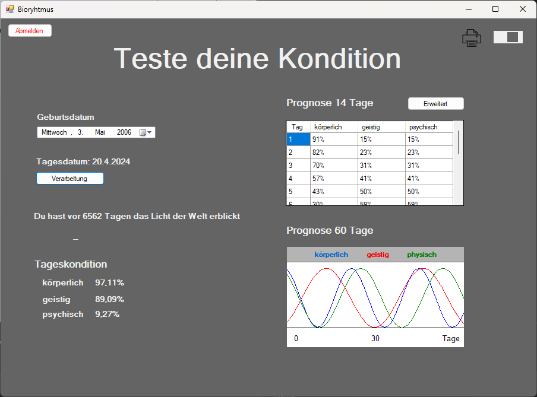
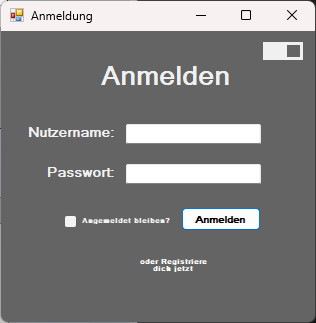
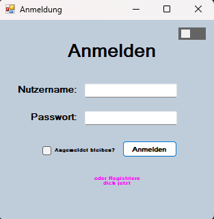
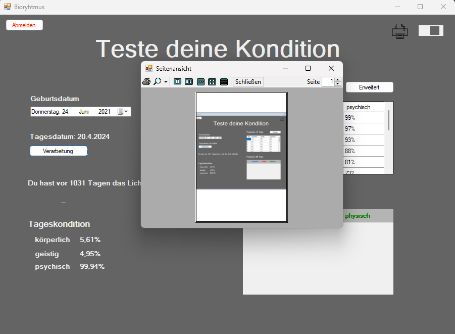
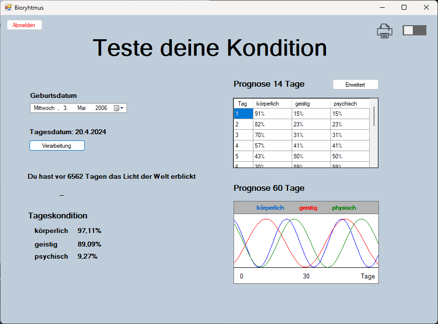

<h1 align="center" id="title">Bioryhtmus-Calculator</h1>

Bei Angabe des Geburtsdatum wird eine Prognose für die psychische geistige und körperliche Gesundheit berechnet. Dabei erhält man für jede Kategorie einen Prozentwert von 0 bis 100 Prozent. Dazu kann man sich mehrere lokale Accounts erstellen um die angegebenen Daten zu speichern. Somit kann man zwischen unterschiedlichen Accounts/ Profilen wechseln. Außerdem gibt es die Funktion die Prognosewerte auszudrucken.

<h2>🧐 Funktionen</h2>

*   14/70-Tage-Prognose der psychischen geistigen und körperlichen Gesundheit
*   Lokales Anmelde- und Registrierungssystem / Profilerstellung
*   Drucken der Prognoseergebnisse

<h2>Preview</h2>

